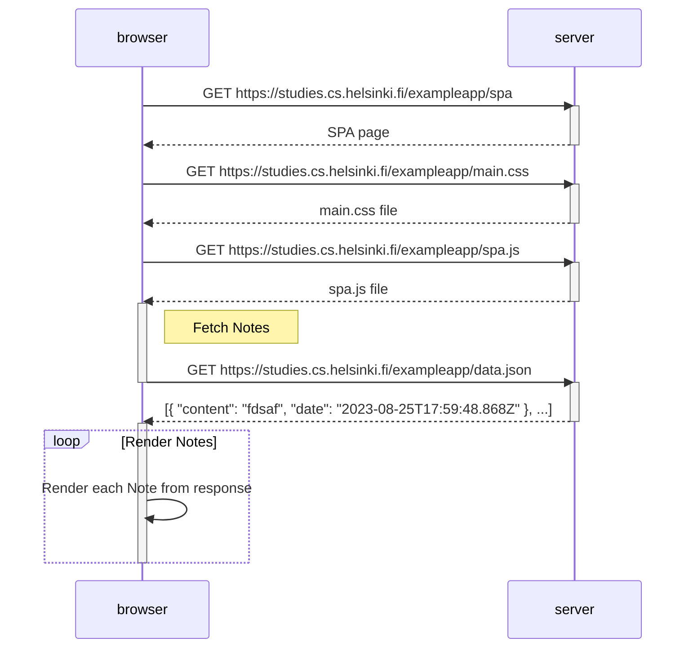

```mermaid
sequenceDiagram
    participant browser
    participant server

    browser->>server: GET https://studies.cs.helsinki.fi/exampleapp/spa
    activate server
    server-->>browser: SPA page
    deactivate server
    
    browser->>server: GET https://studies.cs.helsinki.fi/exampleapp/main.css
    activate server
    server-->>browser: main.css file
    deactivate server

    browser->>server: GET https://studies.cs.helsinki.fi/exampleapp/spa.js
    activate server
    server-->>browser: spa.js file
    deactivate server

    activate browser
    Note right of browser: Fetch Notes
    browser->>server: GET https://studies.cs.helsinki.fi/exampleapp/data.json
    deactivate browser

    activate server
    server-->>browser: [{ "content": "fdsaf", "date": "2023-08-25T17:59:48.868Z" }, ...]
    deactivate server
    
    activate browser
    loop Render Notes
        browser->>browser: Render each Note from response
    end
    deactivate browser
```