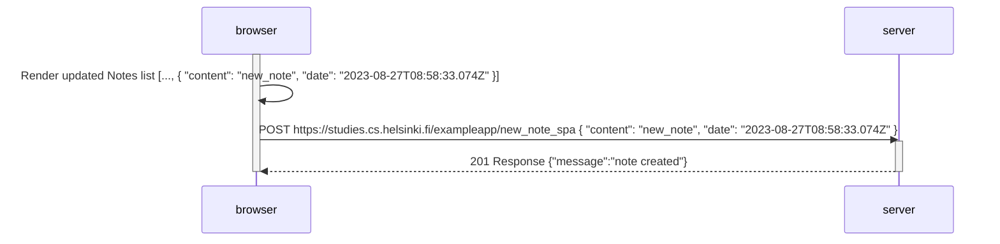

```mermaid
sequenceDiagram
    participant browser
    participant server

    activate browser
    browser->>browser: Render updated Notes list [..., { "content": "new_note", "date": "2023-08-27T08:58:33.074Z" }]
    browser->>server: POST https://studies.cs.helsinki.fi/exampleapp/new_note_spa { "content": "new_note", "date": "2023-08-27T08:58:33.074Z" }
    activate server
    server-->>browser: 201 Response {"message":"note created"}
    deactivate server
    deactivate browser
```